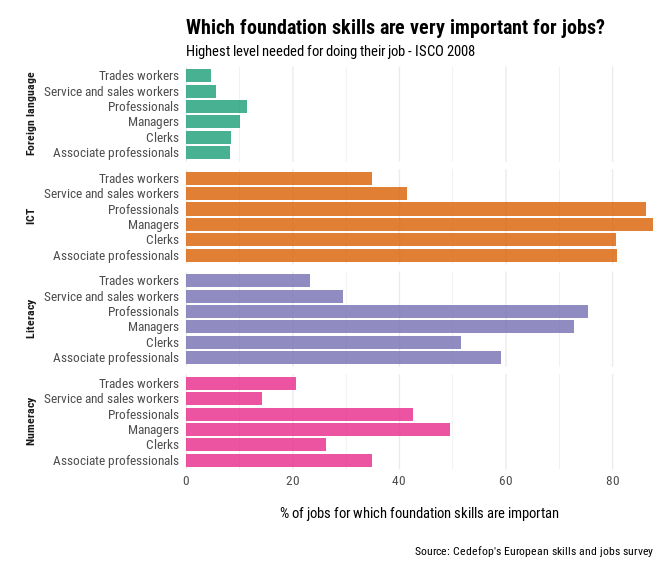
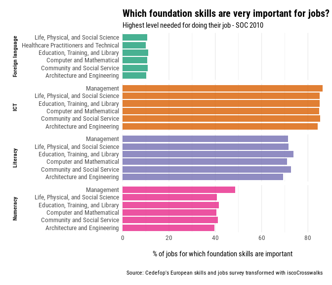

<!-- README.md is generated from README.Rmd. Please edit that file -->

# iscoCrosswalks <a href="http://eworx-org.github.io/iscoCrosswalks/" rel="nofollow"></a>

<!-- badges: start -->

[](https://github.com/eworx-org/iscoCrosswalks/actions)
<!-- badges: end -->

The goal of iscoCrosswalks is to map indicators and raw counts from the
International Standard Classification of Occupations (ISCO) to the
Standard Occupational Classification (SOC) System, and vice versa.

## Installation

You can install the development version of iscoCrosswalks from
[GitHub](https://github.com/) with:

``` r
# install.packages("devtools")
devtools::install_github("eworx-org/iscoCrosswalks")
```

## Example

This is a basic example which shows you how to translate CEDEFOPs
“Importance of foundation skills” indicator given in ISCO(2008) to
SOC(2010) classification:

-   For further details visit [CEDEFOPs skills intelligence
    tool](https://www.cedefop.europa.eu/en/tools/skills-intelligence)

``` r
library(iscoCrosswalks)
```



The percentage of jobs where foundation skills (literacy, numeracy, ICT,
and foreign languages) are highly crucial for doing the work is shown in
this indicator. It is based on the findings of Cedefop’s European survey
of skills and jobs.

The Skills Foundation Indicator is exposed also in `iscoCrosswalks` as
an example data-set. It consists of three variables

-   `Occupations`
-   `Skill`
-   `Value`

To perform the transformation, we’ve added a third column with the
`preferredLabel` from the ISCO taxonomy. In the R terminal, type `isco`
to access the desired labels. Manual entry of preferred labels is
suggested for small data. See also the R package
[labourR](https://cran.r-project.org/web/packages/labourR) for
automating the occupations coding, in case of big data-sets.

Inspecting the indicator,

``` r
knitr::kable(foundation_skills[seq(1 , nrow(foundation_skills), by = 5), ])
```

| Occupations              | preferredLabel                                     | Skill            | Value |
|:-------------------------|:---------------------------------------------------|:-----------------|------:|
| Managers                 | Managers                                           | Foreign language | 10.10 |
| Professionals            | Professionals                                      | ICT              | 86.28 |
| Associate professionals  | Technicians and associate professionals            | Literacy         | 59.06 |
| Clerks                   | Clerical support workers                           | Numeracy         | 26.30 |
| Farm and related workers | Skilled agricultural, forestry and fishery workers | Foreign language |  1.78 |
| Trades workers           | Craft and related trades workers                   | ICT              | 34.80 |
| Operators and assemblers | Plant and machine operators and assemblers         | Literacy         | 18.93 |
| Elementary workers       | Elementary occupations                             | Numeracy         |  7.20 |

To translate the indicator to SOC classification, `iscoCrosswalks` has
two mandatory column names. Namely, `job` and `value` standing for the
preferred labels of the taxonomy and the value of the indicator
respectively.

Thus, we rename `preferredLabel` to `job`, and `Value` to `value`.

``` r
data.table::setnames(foundation_skills,
                     c("preferredLabel", "Value"),
                     c("job", "value"))
```

The `isco_soc_crosswalk()` function can translate the values to the
desired taxonomy. The parameter `brkd_cols` accepts a vector that
indicates other columns used for grouping.

Also, since this is a composite score we set `indicator = TRUE` to use
`mean` value. Instead, if raw counts are given then we set
`indicator = FALSE` to aggregate the units of the hierarchy.

``` r
soc_foundation_skills <- isco_soc_crosswalk(foundation_skills,
                                            brkd_cols = "Skill",
                                            isco_lvl = 1,
                                            soc_lvl = "soc_1",
                                            indicator = TRUE)
```

In the following we visualize the top 6 occupations by Skill, of the
projected indicator to the SOC taxonomy.



If the reverse process is required, use the `soc_isco_crosswalk()`
function. The preffered labels of the taxonomy can be inspected in the
included dataset `soc_groups`.
